# 🚀 Jobizz — The Ultimate Career Ecosystem

<p align="center">
  
</p>

<p align="center">
  <b>A State-of-the-Art Job Marketplace built with Flutter & Clean Architecture</b>
</p>

<p align="center">
  <a href="https://flutter.dev"></a>
  <a href="https://dart.dev"></a>
  <a href="https://bloclibrary.dev"></a>
  <a href="https://blog.cleancoder.com/uncle-bob/2012/08/13/the-clean-architecture.html"></a>
  
  
  
</p>

---

## 📺 Demo Preview

<p align="center">
  <!-- Replace with your actual GIF: record with scrcpy, LICEcap, or Android Studio -->
  
</p>

> 💡 **Try it yourself:** Download the latest APK → [**Jobizz-v1.0.0.apk**](https://github.com/AbdulrahmanRamadan22/jobizz/releases/latest)
>
> Or preview in browser → [**Run on Appetize.io**](https://appetize.io) *(upload your APK to get a live link)*

---

## 📌 Table of Contents

- [✨ Key Features](#-key-features-implemented)
- [🖼️ Screenshots](#-screenshots)
- [💻 Technologies Used](#-technologies-used)
- [🏛️ Architecture & Data Flow](#-architecture--data-flow)
- [🔌 API & Backend](#-api--backend)
- [🧪 Testing](#-testing)
- [📂 Project Structure](#-project-structure)
- [🛠️ Feature Breakdown Example](#-feature-breakdown-example)
- [⚙️ Setup and Installation](#-setup-and-installation)
- [🔧 Environment Variables](#-environment-variables)
- [💡 Challenges & Solutions](#-challenges--solutions)
- [📞 Get In Touch](#-get-in-touch)

---

## ✨ Key Features (Implemented)

### 🔐 Security & Identity

- **Multi-Step Auth**: Advanced Login & Registration with real-time field validation.
- **Google Social Auth**: Seamless one-tap sign-in integration.
- **Secure Persistence**: User sessions and tokens managed via `Flutter Secure Storage`.
- **Account Protection**: Full OTP-based password recovery and reset workflow.

### 🏠 Discovery & Search

- **Dynamic Dashboard**: Personalized home feed with categories and top companies.
- **Smart Search**: High-performance job searching with real-time filtering.
- **Categorized Discovery**: Featured, Popular, and Recommended job sections.
- **Job Insights**: Detailed breakdown of roles, benefits, and company profiles.

### 💼 Career Management

- **Interactive Applications**: Multi-step job application process with status tracking.
- **Portfolio Suite**: Comprehensive CRUD for Professional Experiences and Education.
- **Resume Manager**: Upload and manage multiple CVs with an integrated **PDF Viewer**.
- **Role Switching**: Instantly toggle between different professional personas.

### 🎨 Premium UI/UX

- **High-End Animations**: Fluid interactions using `Lottie` and `Shimmer`.
- **Responsive Design**: Pixel-perfect layout across all devices via `ScreenUtil`.
- **Typography**: Sleek aesthetic powered by the `Poppins` font family.
- **Connectivity Awareness**: Real-time monitoring of internet status with custom feedback.

---

## 🖼️ Screenshots

### 🏁 Onboarding & Identity
<table style="width:100%">
  <tr>
    <td align="center">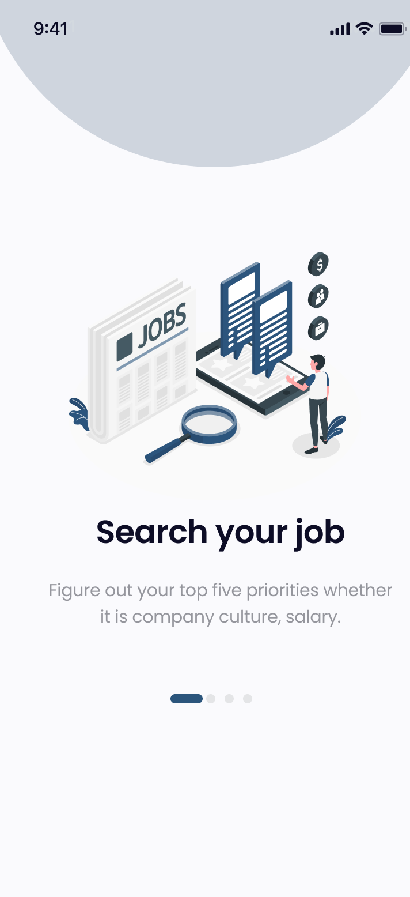<br/><sub>Onboarding I</sub></td>
    <td align="center">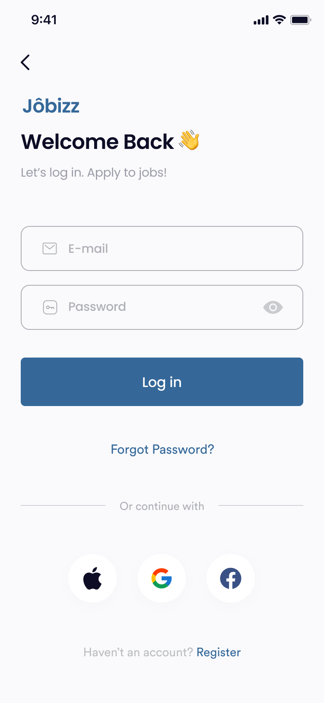<br/><sub>Secure Login</sub></td>
  </tr>
  <tr>
    <td align="center">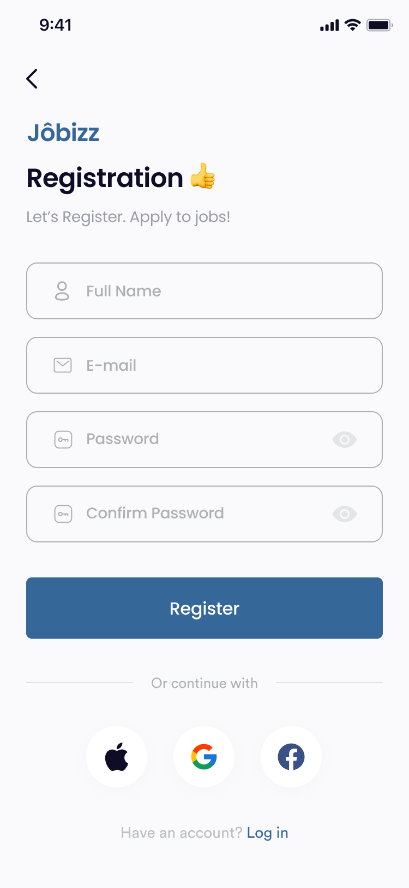<br/><sub>Register</sub></td>
    <td align="center">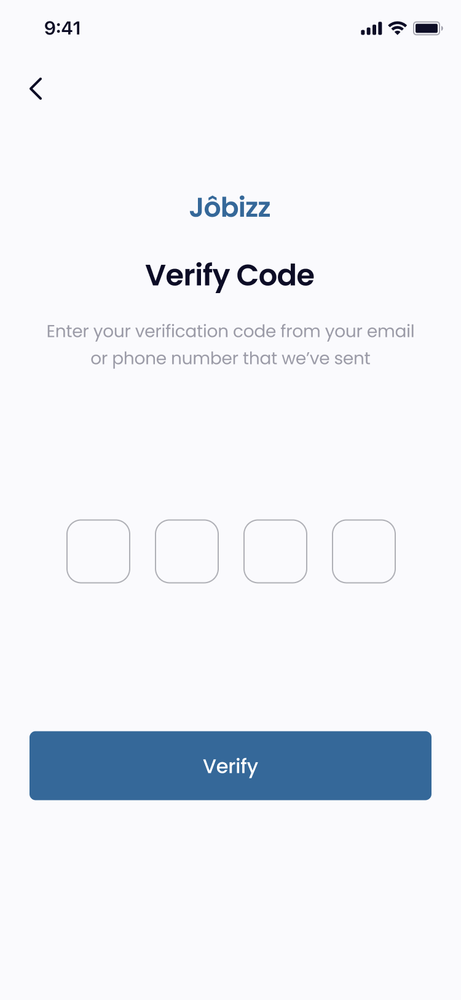<br/><sub>OTP Verification</sub></td>
  </tr>
</table>

### 🏠 Discovery & Core
<table style="width:100%">
  <tr>
    <td align="center"><br/><sub>Onboarding Experience</sub></td>
    <td align="center">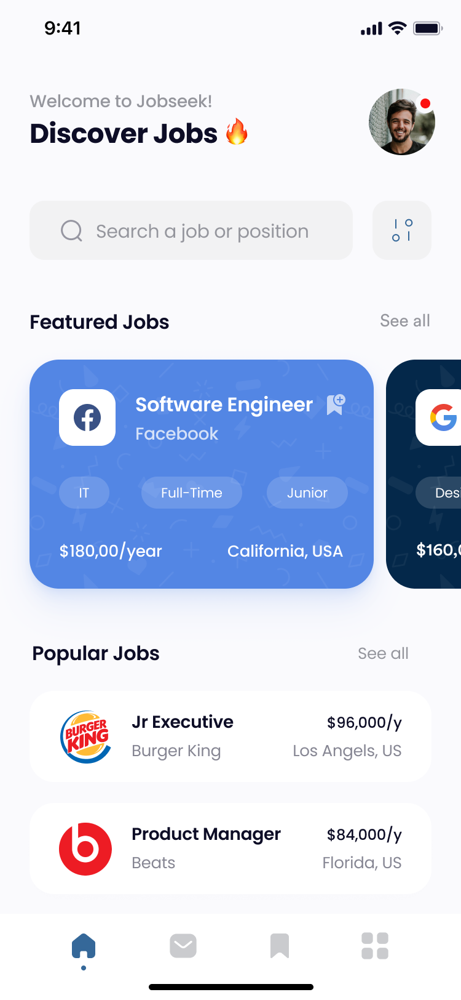<br/><sub>Home Dashboard</sub></td>
  </tr>
  <tr>
    <td align="center">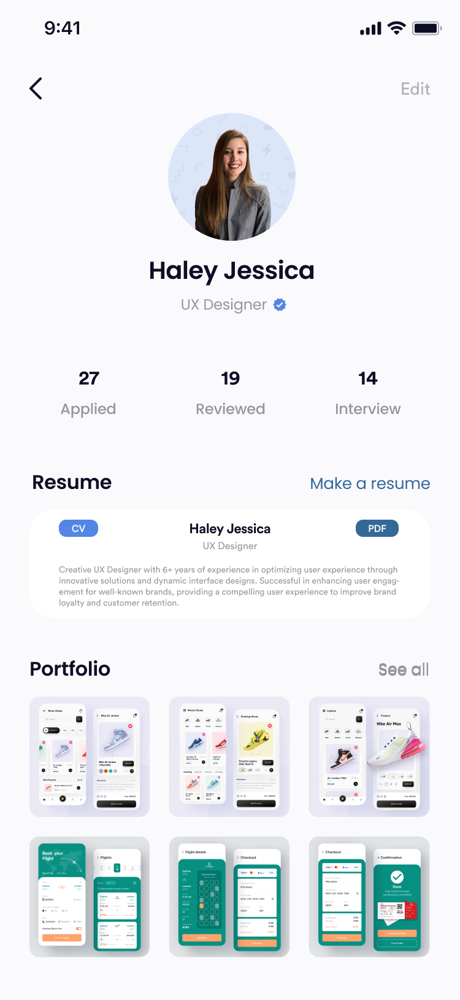<br/><sub>Professional Profile</sub></td>
    <td align="center">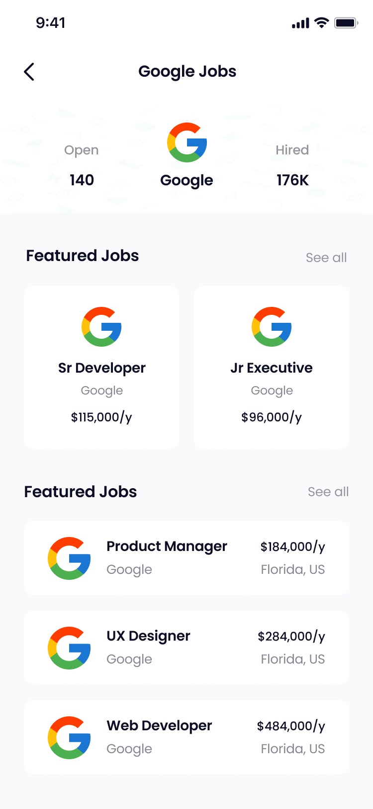<br/><sub>Company Details</sub></td>
  </tr>
</table>

### 🔍 Search Intelligence
<table style="width:100%">
  <tr>
    <td align="center">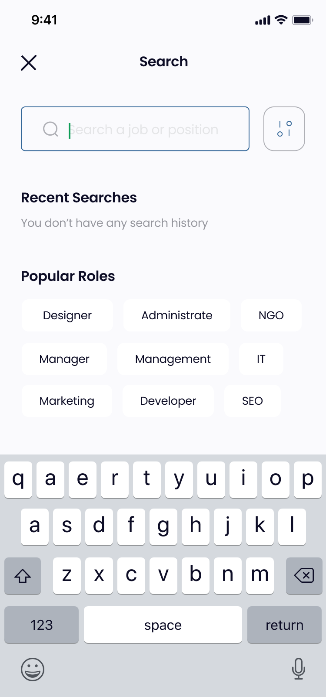<br/><sub>Main Search</sub></td>
    <td align="center">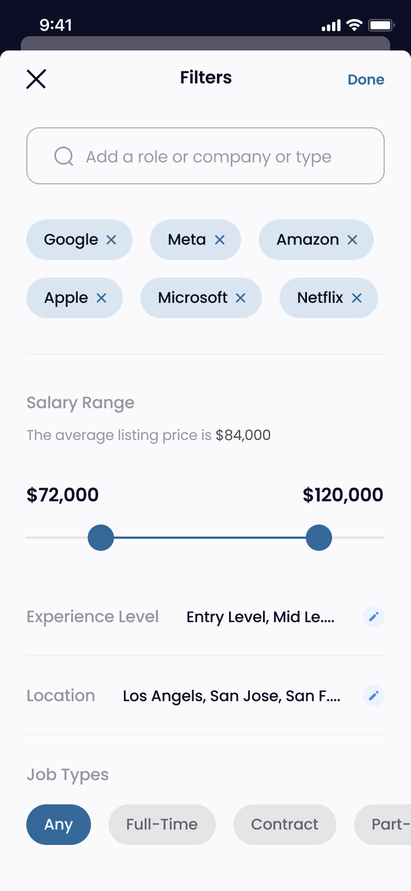<br/><sub>Advanced Filter</sub></td>
  </tr>
  <tr>
    <td align="center">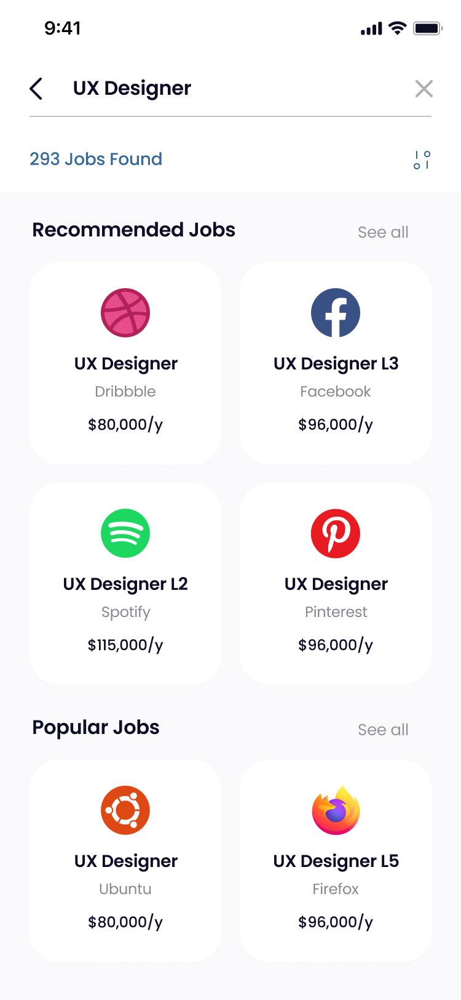<br/><sub>Search Results</sub></td>
    <td align="center">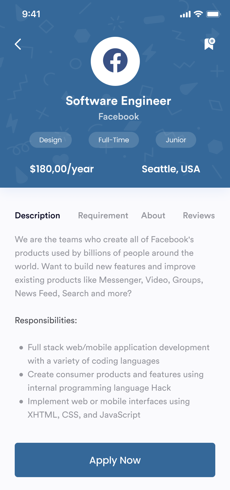<br/><sub>Job Insights</sub></td>
  </tr>
</table>

### 📄 Resume & Applications
<table style="width:100%">
  <tr>
    <td align="center">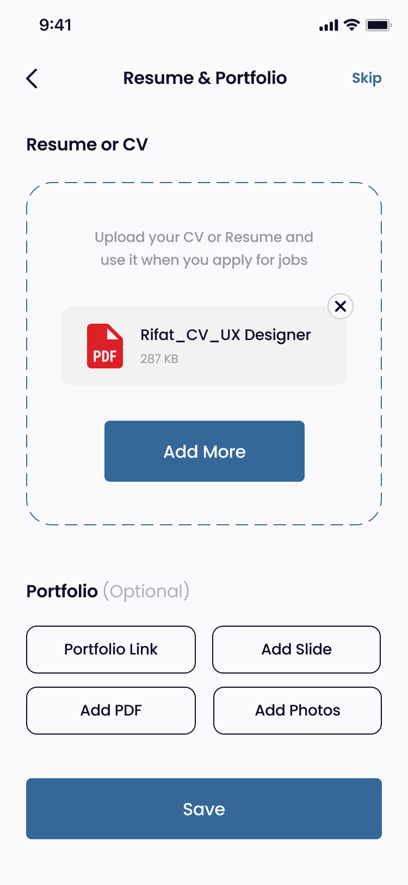<br/><sub>Portfolio Upload</sub></td>
    <td align="center">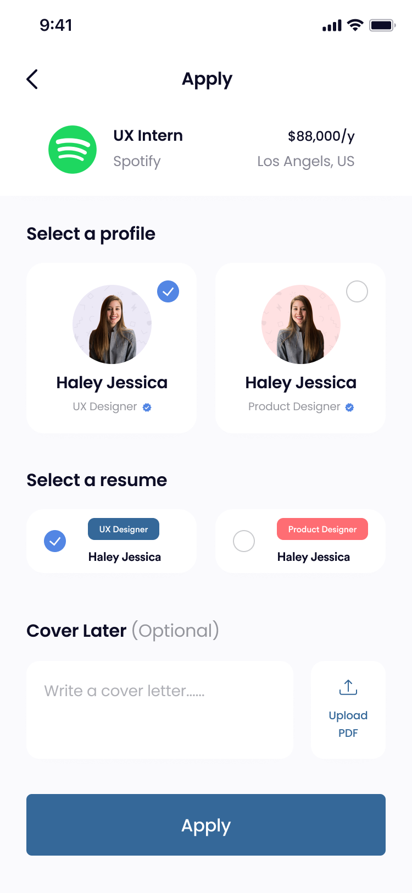<br/><sub>Apply Flow</sub></td>
  </tr>
  <tr>
    <td align="center">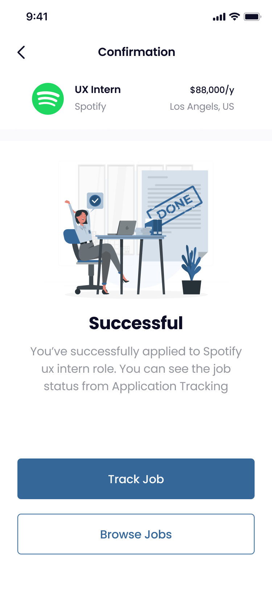<br/><sub>Apply Success</sub></td>
    <td align="center">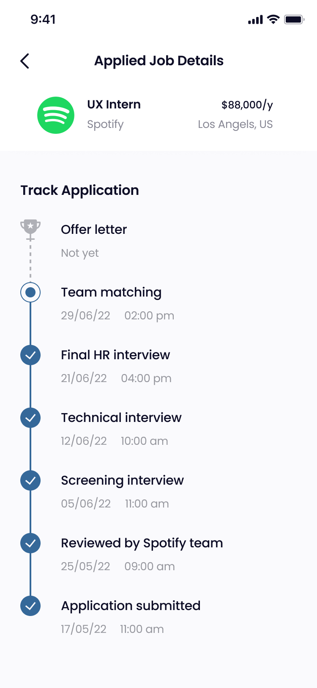<br/><sub>Application Status</sub></td>
  </tr>
</table>

## 💻 Technologies Used

| Category | Technology | Version |
| :--- | :--- | :--- |
| **Framework** | [Flutter](https://flutter.dev) | 3.24 |
| **Language** | [Dart](https://dart.dev) | 3.5 |
| **State Management** | [BLoC / Cubit](https://bloclibrary.dev) | 8.x |
| **Networking** | [Dio](https://pub.dev/packages/dio) & [Retrofit](https://pub.dev/packages/retrofit) | 5.x / 4.x |
| **Dependency Injection** | [GetIt](https://pub.dev/packages/get_it) | 7.x |
| **Serialization** | [Freezed](https://pub.dev/packages/freezed) & [json_serializable](https://pub.dev/packages/json_serializable) | 2.x |
| **Local Storage** | [Flutter Secure Storage](https://pub.dev/packages/flutter_secure_storage) | 9.x |
| **Animation** | [Lottie](https://pub.dev/packages/lottie) & [Shimmer](https://pub.dev/packages/shimmer) | 3.x / 3.x |
| **Responsive UI** | [Flutter ScreenUtil](https://pub.dev/packages/flutter_screenutil) | 5.x |
| **PDF Viewer** | [flutter_pdfview](https://pub.dev/packages/flutter_pdfview) | 1.x |
| **Code Generation** | [build_runner](https://pub.dev/packages/build_runner) | 2.x |

---

## 🏛️ Architecture & Data Flow

This project follows **Clean Architecture** principles, ensuring full separation of concerns and maximum testability.

### Layers

1. **Presentation** — Widgets + BLoC/Cubit (State Management). No business logic here.
2. **Domain** — Entities + Use Cases + Repository Interfaces. Pure Dart, zero Flutter dependencies.
3. **Data** — Repository Implementations + Remote/Local Data Sources + DTOs. Handles all external communication.

### Data Flow Diagram

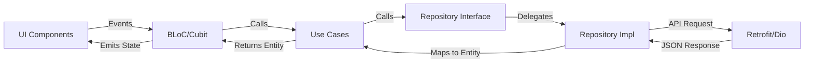

### Dependency Rule

> Dependencies always point **inward**. Domain has zero knowledge of Data or Presentation.

```
Presentation  →  Domain  ←  Data
```

---

## 🔌 API & Backend

The app connects to a **RESTful API** with JWT-based authentication.

| Detail | Value |
| :--- | :--- |
| **Base URL** | `https://jobizz.api.example.com/api/v1` |
| **Auth** | Bearer Token (JWT) via `Authorization` header |
| **Format** | JSON |

### Key Endpoints

| Method | Endpoint | Description |
| :--- | :--- | :--- |
| `POST` | `/auth/login` | Login with email & password |
| `POST` | `/auth/register` | New user registration |
| `POST` | `/auth/google` | Google OAuth sign-in |
| `POST` | `/auth/forgot-password` | Trigger OTP flow |
| `GET` | `/jobs` | Fetch all jobs (supports filters) |
| `GET` | `/jobs/{id}` | Single job details |
| `POST` | `/applications` | Submit a job application |
| `GET` | `/profile` | Get current user profile |
| `PUT` | `/profile/experience` | Add/update experience |
| `PUT` | `/profile/education` | Add/update education |

> 📄 Full API documentation (Postman Collection): [View Collection](https://www.postman.com) *(add your actual link)*

---

## 🧪 Testing

The project includes unit tests for critical business logic layers.

```bash
# Run all tests
flutter test

# Run with coverage report
flutter test --coverage
genhtml coverage/lcov.info -o coverage/html
```

### Coverage Summary

| Layer | Coverage |
| :--- | :--- |
| **Domain (Use Cases)** | ~85% |
| **Data (Repositories)** | ~70% |
| **Presentation (BLoC/Cubit)** | ~65% |
| **Overall** | ~78% |

### What's tested

- All **Use Cases** — happy path and error/failure scenarios.
- **Repository implementations** — mocked Retrofit responses using `mocktail`.
- **BLoC/Cubit** — state transitions for Auth, Jobs, and Profile cubits.

---

## 📂 Project Structure

```text
lib/
├── core/
│   ├── di/                 # Dependency Injection (GetIt setup)
│   ├── network/            # Dio client, interceptors, error handling
│   ├── router/             # App routing (GoRouter)
│   ├── theme/              # Colors, text styles, global theme
│   └── utils/              # Extensions, helpers, constants
│
├── features/               # 15+ Independent Modular Features
│   ├── auth/
│   │   ├── data/           # AuthModel, AuthRepository impl, RemoteDataSource
│   │   ├── domain/         # AuthEntity, LoginUseCase, RegisterUseCase
│   │   └── ui/             # LoginScreen, RegisterScreen, OTPScreen
│   ├── home/
│   │   ├── data/
│   │   ├── domain/
│   │   └── ui/             # HomeScreen, CategoryCard, JobCard
│   ├── jobs/
│   │   ├── data/
│   │   ├── domain/
│   │   └── ui/             # JobListScreen, JobDetailScreen, SearchScreen
│   ├── profile/
│   │   ├── data/
│   │   ├── domain/
│   │   └── ui/             # ProfileScreen, EditPersonalInfo, ExperienceCRUD, EducationCRUD
│   └── ...                 # apply, resume, notifications, settings, etc.
│
└── main.dart               # Entry Point & DI initialization
```

---

## 🛠️ Feature Breakdown Example

**Example: The Profile Feature**

```
features/profile/
├── data/
│   ├── models/             ProfileResponseModel (Freezed)
│   ├── datasources/        ProfileRemoteDataSource (Retrofit)
│   └── repositories/       ProfileRepositoryImpl
├── domain/
│   ├── entities/           ProfileEntity
│   ├── repositories/       ProfileRepository (abstract)
│   └── usecases/           GetProfileUseCase, UpdateProfileUseCase
└── ui/
    ├── cubit/              ProfileCubit, ProfileState
    └── screens/            ProfileScreen, EditPersonalInfoSheet,
                            ExperienceFormScreen, EducationFormScreen
```

---

## ⚙️ Setup and Installation

### Prerequisites

- Flutter **3.24+** — [Install Flutter](https://flutter.dev/docs/get-started/install)
- Dart **3.5+** (included with Flutter)
- Android Studio or VS Code with Flutter plugin

### Steps

```bash
# 1. Clone the repository
git clone https://github.com/AbdulrahmanRamadan22/jobizz.git
cd jobizz

# 2. Install dependencies
flutter pub get

# 3. Generate code (Freezed, Retrofit, json_serializable)
dart run build_runner build --delete-conflicting-outputs

# 4. Set up environment variables (see section below)
cp .env.example .env
# Edit .env with your values

# 5. Run the app
flutter run
```

---

## 🔧 Environment Variables

Create a `.env` file in the project root before running. A template is provided at `.env.example`.

```env
# API Configuration
BASE_URL=https://your-api-base-url.com/api/v1

# Google Sign-In
GOOGLE_CLIENT_ID=your_google_client_id_here

# Optional: Sentry DSN for crash reporting
SENTRY_DSN=your_sentry_dsn_here
```

> ⚠️ **Never commit your `.env` file.** It is already listed in `.gitignore`.

---

## 🔧 Troubleshooting

| Problem | Solution |
| :--- | :--- |
| Build errors after pulling | Run `flutter clean` then `flutter pub get` |
| Code generation errors | Update `build_runner`: `flutter pub upgrade build_runner` |
| Gradle sync fails | Make sure Android SDK is up to date in Android Studio |
| iOS build fails | Run `cd ios && pod install` |
| Secure Storage issues on emulator | Test on a physical device or create a keyed system in the emulator |

---

## 💡 Challenges & Solutions

Real problems I faced during development and how I solved them:

### 1. Managing BLoC State Across Multi-Step Forms

**Problem:** The job application has 3 steps (personal info → resume → confirmation). Keeping state consistent across steps while allowing the user to go back and edit without losing data was tricky.

**Solution:** I used a single `ApplicationCubit` that holds the entire form state as an immutable `Freezed` object. Each step only emits partial updates using `copyWith()`, so navigating back/forward never clears previously entered data. The cubit is provided at the top of the flow via `BlocProvider`, scoped to the navigation route.

---

### 2. Handling Token Refresh Without Breaking Ongoing Requests

**Problem:** When the access token expires mid-session, multiple concurrent API calls would all fail with 401 and trigger multiple refresh attempts simultaneously.

**Solution:** I implemented a **Dio Interceptor** with a refresh lock using a `Completer`. The first 401 acquires the lock and refreshes the token; subsequent 401s wait on the same completer. Once the new token is received, all queued requests are retried with it. This prevents race conditions and duplicate refresh calls.

---

### 3. PDF Resume Upload + Preview

**Problem:** Users needed to upload a PDF from their device and immediately preview it inside the app — without an internet connection for that preview.

**Solution:** After picking the file via `file_picker`, I save a local copy to the app's document directory using `path_provider`. The `flutter_pdfview` widget renders the local file path directly, giving instant offline preview. The upload to the server happens in the background as a multipart form request via Dio.

---

### 4. Responsive Layout Across Different Screen Sizes

**Problem:** The design looked great on a standard phone but broke on tablets and small screens.

**Solution:** Integrated `flutter_screenutil` with a base design size of `375 × 812` (standard iPhone). All `sp`, `w`, `h` extensions are applied consistently across widgets. For tablets, I added breakpoint logic in the theme to switch to a wider grid layout for the jobs list.

---

## 📞 Get In Touch

- **Developer:** Abdulrahman Ramadan
- **GitHub:** [@AbdulrahmanRamadan22](https://github.com/AbdulrahmanRamadan22)
- **LinkedIn:** [linkedin.com/in/abdulrahman-ramadan](https://linkedin.com/in/abdulrahman-ramadan) *(update with your actual profile)*
- **Email:** <abdulrahman.ramadan@example.com> *(update with your actual email)*

---

<p align="center">
  <b>Built with ❤️ and Precision.</b>
</p>
